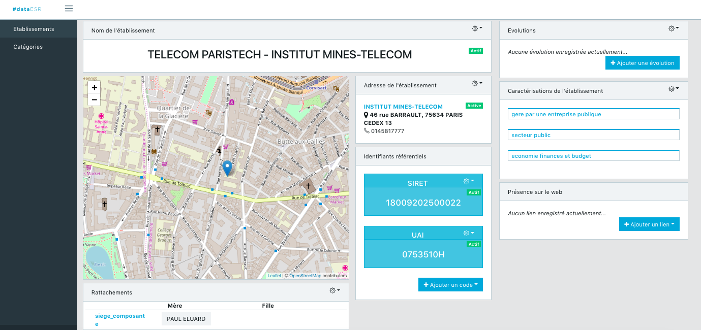

# DataESR Authentification

DataESR Authentification is a Rails open source microservice to manage Users and authentification through API. 

### Ruby version

2.4.0

### Installation

First, clone down the repository:

    git clone https://github.com/MinistereSupRecherche/data_esr_authenfication.git && cd data_esr_authentification

Update dependencies, run:

    bundle install

Create database, run:

    rake db:create

Run migrations:

    rake db:migrate
    
Populate database, run:
     
     rake db:seed
    
### Launch 

In a console, launch the Rails server, run :

    rails s

That's it ! 
